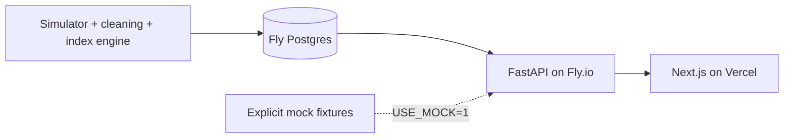

# APIx — India Airfare Observatory

[](https://github.com/Aryan-Arora/APIx-/actions/workflows/ci.yml)

A read-only airfare price-index API and dashboard for SIH 2026, PS 26056. It distinguishes observed quotes, simulated history and illustrative mock fixtures. This is a research prototype, **not an official MoSPI/NSO/RBI statistic**.

## Live deployment

- **Dashboard:** https://apix-dashboard-sigma.vercel.app
- **API:** https://apix-api.fly.dev/api/v1 (interactive docs at `/docs`)

## Current delivery status

Both engineering tracks (`pipeline/` + `data/` for the data plane, `api/` + `web/` for the serving plane) are integrated on `main`, tested, and deployed. The database is seeded with ~11,500+15,000 simulator-generated fare quotes across two windows — a recent ~45-day window for the live demo, and a Nov–Dec 2025 window chosen to overlap real reference data for the backtest — producing ~2,800 `index_values` rows. **Every quote is synthetic** (`is_synthetic=true`), generated by a calibrated simulator, never presented as scraped/observed data; this is labelled throughout the UI and API. Live scraping adapters exist as stubs (see [`docs/SCRAPING.md`](docs/SCRAPING.md)) — no live scrape has succeeded yet.

The reference backtest against MoSPI's real CPI "Transport and communication" sub-group index (Base 2012=100) is wired up with actual sourced figures — see [`docs/BACKTEST.md`](docs/BACKTEST.md) for the exact values, the base-year discontinuity caveat, and why the correlation/direction-agreement numbers (computed from only 2 overlapping months) are not statistically meaningful on their own. DGCA route-level average-fare data is still a placeholder; that comparison is withheld from the UI, not fabricated.

## Local quickstart

Python 3.11 and Node.js 22 are the deployment/CI targets.

```bash
cd api
python3.11 -m venv .venv
source .venv/bin/activate
pip install -r requirements.lock.txt
USE_MOCK=1 API_KEYS=apix-local-demo uvicorn app.main:app --host 127.0.0.1 --port 8000 --no-proxy-headers
```

In another terminal:

```bash
cd web
cp .env.example .env.local
npm ci
npm run dev
```

Open http://localhost:3000 and http://localhost:8000/docs. The example key is deliberately public and read-only; it is not a private credential.

## Connect Engineer A's database

Configure `USE_MOCK=0`, `DATABASE_URL`, `API_KEYS`, and `ALLOWED_ORIGINS` in the API environment. For Supabase use the session pooler URL with SSL and a SELECT-only role. The API never creates or alters tables. Missing schema/data is reported as an error or empty result, never silently replaced with mock values. See [handoff notes](HANDOFF_NOTES.md).

Set `NEXT_PUBLIC_API_BASE` to the API's full `/api/v1` base and `NEXT_PUBLIC_API_KEY` to the public demo key. Rebuild the web app after changing public variables.



Actual live deployment: API on Fly.io (`apix-api`), Postgres on a Fly Postgres cluster (`apix-db`), dashboard on Vercel. `docs/DEPLOY.md`'s Render/Supabase instructions are kept as a documented alternative path; they were not what was actually used for the live URLs above.

## Verification

```bash
PYTHONPATH=api api/.venv/bin/pytest api/tests -q
api/.venv/bin/ruff check api/app api/tests
api/.venv/bin/black --check api/app api/tests
cd web
npm run lint
npm run typecheck
npm run build
```

CI runs the serving checks and Engineer A's pipeline tests once delivered. Main fails if the pipeline is missing. Feature-branch CI explicitly reports the missing pipeline.

## Documentation

- [Architecture](docs/ARCHITECTURE.md)
- [API contract and examples](docs/API.md)
- [User guide](docs/USER_GUIDE.md)
- [Deployment steps](docs/DEPLOY.md)
- [Limitations](docs/LIMITATIONS.md)
- [Demo flow](docs/DEMO_FLOW.md)

The live API at https://apix-api.fly.dev runs with `min_machines_running = 1` (no cold starts) and returns `db=connected`, `data_mode=database` at `/api/v1/health`.

## Local integration preview

For local development against a real (non-mock) DB: point `DATABASE_URL` at a Postgres instance (or run the pipeline's SQLite default), run the pipeline's `backfill`/`compute-index`/`backtest` commands (see [`HANDOFF_NOTES.md`](HANDOFF_NOTES.md) for exact commands, including the two-window backfill needed for a real backtest), then start the API with `USE_MOCK=0`. See [verification record](docs/VERIFICATION.md) for test evidence.
