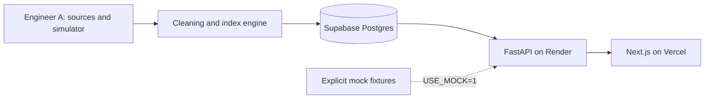

# APIx — India Airfare Observatory

[](https://github.com/Aryan-Arora/APIx-/actions/workflows/ci.yml)

A read-only airfare price-index API and dashboard for SIH 2026, PS 26056. It distinguishes observed quotes, simulated history and illustrative mock fixtures. This is a research prototype, **not an official MoSPI/NSO/RBI statistic**.

## Current delivery status

Engineer B's serving plane is implemented in `api/` and `web/`. Engineer A owns `pipeline/`, `data/`, the schema and index computation. A’s branch has been integrated into `feat/api-web`; the local SQLite pipeline has generated 11,500 synthetic quotes across 46 dates and 1,176 index rows. No live quotes exist. Known pipeline-method/backtest issues are recorded in [handoff notes](HANDOFF_NOTES.md). Mock mode is explicit (`USE_MOCK=1`); it is never a fallback for a failing database. Mock live-only series are empty. No live scrape runs or reference accuracy scores are invented.

Public deployment URLs: pending account/service configuration and integration. Do not interpret a passing serving-plane test as proof of live data, published backtest accuracy, or pipeline readiness.

## Local quickstart

Python 3.11 and Node.js 22 are the deployment/CI targets.

```bash
cd api
python3.11 -m venv .venv
source .venv/bin/activate
pip install -r requirements.lock.txt
USE_MOCK=1 API_KEYS=apix-local-demo uvicorn app.main:app --host 127.0.0.1 --port 8000 --no-proxy-headers
```

In another terminal:

```bash
cd web
cp .env.example .env.local
npm ci
npm run dev
```

Open http://localhost:3000 and http://localhost:8000/docs. The example key is deliberately public and read-only; it is not a private credential.

## Connect Engineer A's database

Configure `USE_MOCK=0`, `DATABASE_URL`, `API_KEYS`, and `ALLOWED_ORIGINS` in the API environment. For Supabase use the session pooler URL with SSL and a SELECT-only role. The API never creates or alters tables. Missing schema/data is reported as an error or empty result, never silently replaced with mock values. See [handoff notes](HANDOFF_NOTES.md).

Set `NEXT_PUBLIC_API_BASE` to the API's full `/api/v1` base and `NEXT_PUBLIC_API_KEY` to the public demo key. Rebuild the web app after changing public variables.



## Verification

```bash
PYTHONPATH=api api/.venv/bin/pytest api/tests -q
api/.venv/bin/ruff check api/app api/tests
api/.venv/bin/black --check api/app api/tests
cd web
npm run lint
npm run typecheck
npm run build
```

CI runs the serving checks and Engineer A's pipeline tests once delivered. Main fails if the pipeline is missing. Feature-branch CI explicitly reports the missing pipeline.

## Documentation

- [Architecture](docs/ARCHITECTURE.md)
- [API contract and examples](docs/API.md)
- [User guide](docs/USER_GUIDE.md)
- [Deployment steps](docs/DEPLOY.md)
- [Limitations](docs/LIMITATIONS.md)
- [Demo flow](docs/DEMO_FLOW.md)

Warm a sleeping Render service by opening `/api/v1/health` a minute before recording; health must return `db=connected` for a live-data claim. Free-tier cold starts mean a sub-three-second first data load cannot be guaranteed.

## Integration preview in this workspace

The current local preview runs at http://localhost:3000 with API docs at http://localhost:8100/docs (8000 is occupied by another application). It reads `apix.db` generated by A's simulator, with **no live observations**. See [verification record](docs/VERIFICATION.md) for test evidence and outstanding integration/deployment issues.
